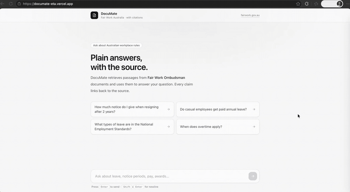
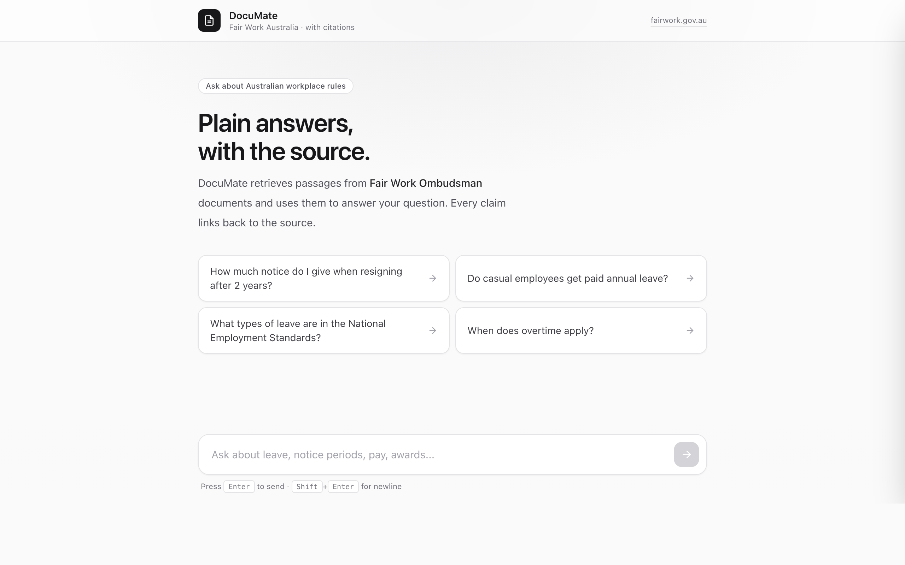
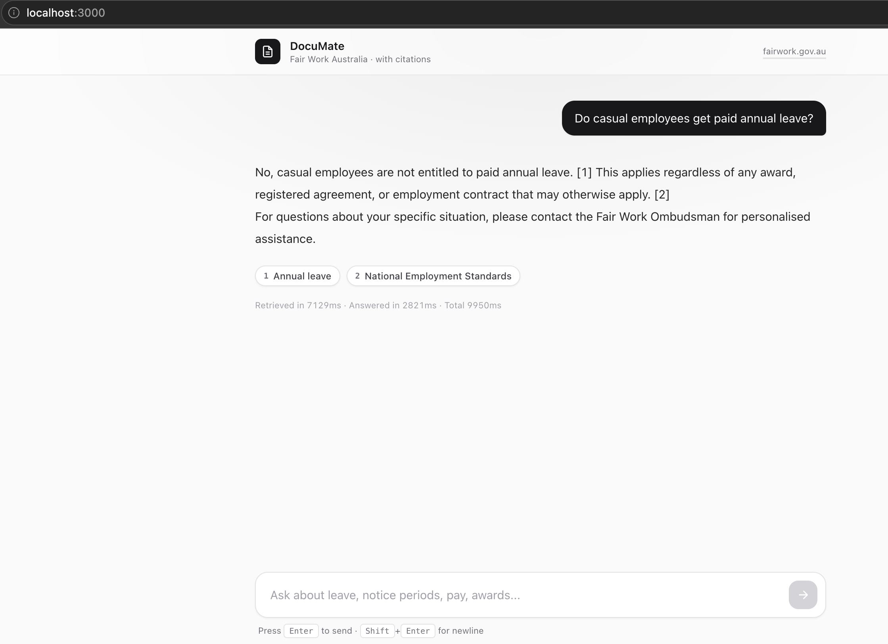
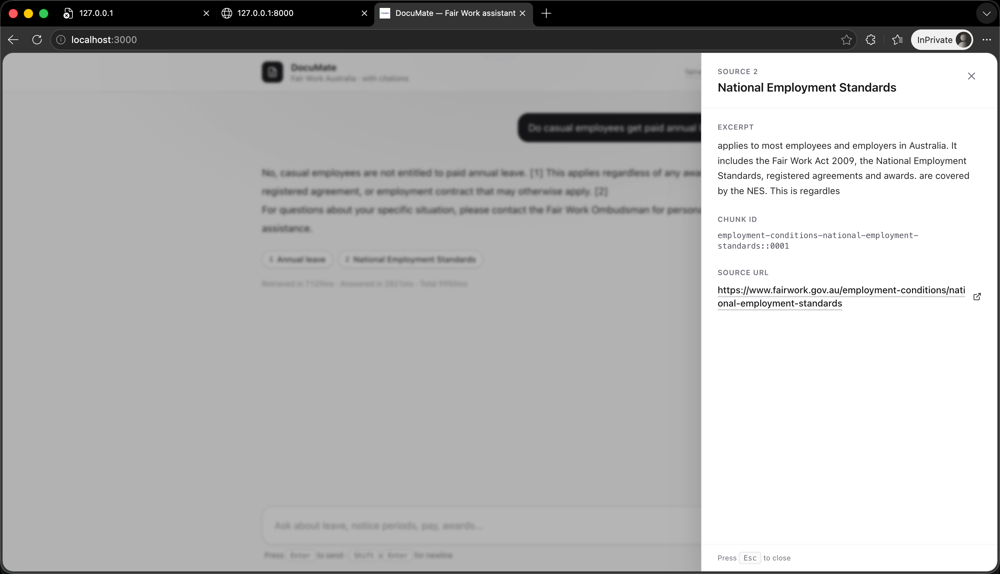
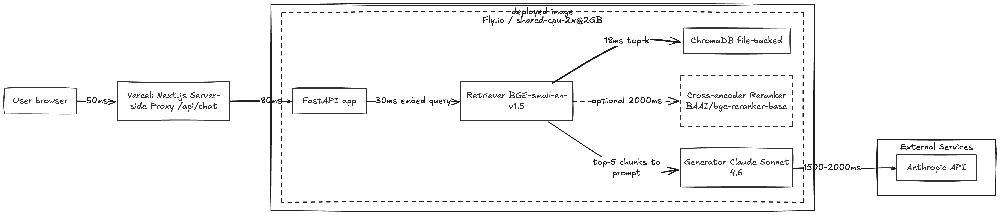

# DocuMate

An internal knowledge assistant that answers employee questions over company docs, with inline citations. Built end-to-end: ingestion pipeline → vector retrieval → Claude → Next.js chat UI, plus a custom evaluation framework.

**[Live demo](https://documate-eta.vercel.app/)** · **[Architecture](docs/architecture.md)** · **[Evals](docs/evals.md)** · **[Deploy guide](docs/deployment.md)**

> **Note on the live demo.** The Fly.io backend is configured to auto-stop during inactivity (deliberate cost-engineering — idle running cost is roughly $0/month). The first request after a quiet period takes ~30–45 s to wake the machine and load the embedder, which can exceed the proxy's timeout and surface as a `502 Backend unreachable` in the UI. If that happens on your first message, send the same query again — subsequent requests are fast. The wake-on-cold-start tradeoff is documented in [docs/architecture.md](docs/architecture.md) and [docs/deployment.md](docs/deployment.md).



<sub>End-to-end walkthrough. If the GIF isn't loading, the static screenshots below show the same flow.</sub>



<sub>An answered conversation: inline `[1]` / `[2]` citation markers, clickable chips below labelled by source title, and a latency breakdown.</sub>



<sub>Clicking a chip opens the right-side source drawer with excerpt, chunk ID, and a link to the original Fair Work Ombudsman page.</sub>



## Why

Employees waste hours hunting for answers that already exist in policy docs, runbooks, and onboarding wikis. DocuMate is a thin, focused RAG app that demonstrates a production shape for this problem — not a demo notebook.

Scope: single-tenant, read-only corpus ([Fair Work Australia](https://www.fairwork.gov.au/)), answers with inline citations, and a repeatable eval framework so retrieval/generation changes can be measured.

## Corpus

DocuMate indexes ~40–60 pages from the [Fair Work Ombudsman](https://www.fairwork.gov.au/) website, covering six topic areas of practical employer/employee questions:

1. Pay and wages (minimum wage, penalty rates, allowances)
2. Leave (annual, personal/carer's, parental, long service)
3. Ending employment (notice, redundancy, unfair dismissal)
4. Employment conditions (hours, breaks, rosters)
5. Awards (modern awards overview)
6. Small business

The seed URLs are version-controlled at [backend/scripts/sources.yaml](backend/scripts/sources.yaml). Pages are fetched once via `make scrape`, normalized to markdown with [trafilatura](https://trafilatura.readthedocs.io/), and committed to [data/processed/](data/processed/) along with [data/processed/manifest.json](data/processed/manifest.json) — the corpus lockfile. Re-running the scraper is idempotent. News, media releases, case studies, and PDFs are filtered out.

**Attribution:** Content © Commonwealth of Australia (Fair Work Ombudsman), used under [CC BY 4.0](https://creativecommons.org/licenses/by/4.0/). DocuMate is an unofficial, non-commercial portfolio project and is not affiliated with or endorsed by Fair Work.

## How it works



1. **Ingest:** HTML docs → normalized → chunked (recursive, 500 tok / 50 overlap) → embedded locally (`BAAI/bge-small-en-v1.5` via sentence-transformers, runs on CPU) → ChromaDB.
2. **Retrieve:** top-k cosine search; optional cross-encoder reranking (see eval results).
3. **Generate:** Claude Sonnet answers with retrieved context. Prompt enforces *"answer only from context or say you don't know"* and cites chunk IDs.
4. **UI:** Next.js chat. Citations are clickable chips that scroll to the source chunk.

Deeper architecture detail in [docs/architecture.md](docs/architecture.md).

## Quickstart

```bash
# Prereqs: Python 3.11+, Node 20+, uv, pnpm
cp .env.example .env   # fill in ANTHROPIC_API_KEY

make install           # uv sync + pnpm install
make ingest            # loads data/raw/ → data/chroma/
make dev               # FastAPI on :8000, Next.js on :3000
make eval              # runs the baseline eval config
```

## Evaluation

Custom eval framework measuring retrieval quality and answer faithfulness against a hand-crafted dataset of ~30 Q&A pairs across 6 categories (factual lookup, multi-hop, aggregation, negation, out-of-scope, ambiguous).

| Config                      | Hit@5 | MRR  | Faithfulness | Citation F1 | MustContain | Refusal |
|-----------------------------|-------|------|--------------|-------------|-------------|---------|
| Baseline (n=30)             | 0.96  | 0.90 | 0.97         | 0.64        | 0.87        | 0.43    |
| + Cross-encoder rerank      | 0.96  | 0.84 | 0.93         | 0.78        | 0.90        | 0.43    |
| Δ                           | +0.00 | -0.06 ▼ | -0.03 ▼   | +0.13 ▲     | +0.03 ▲     | +0.00   |

Per-category breakdown (baseline → reranked, n shown):

| Category            | n | Hit@5         | MRR            | Faithful       | Cite F1        | MustContain    | Refusal       |
|---------------------|---|---------------|----------------|----------------|----------------|----------------|---------------|
| factual_lookup      |10 | 1.00 → 1.00   | 0.95 → 0.95    | 1.00 → 1.00    | 0.80 → 0.83 ▲  | 1.00 → 1.00    | —             |
| multi_hop           | 5 | 1.00 → 0.80 ▼ | 0.84 → 0.60 ▼  | 0.80 → 0.80    | 0.37 → 0.50 ▲  | 0.60 → 0.80 ▲  | —             |
| aggregation         | 4 | 1.00 → 1.00   | 1.00 → 0.88 ▼  | 1.00 → 1.00    | 0.75 → 0.83 ▲  | 1.00 → 1.00    | —             |
| negation            | 4 | 0.75 → 1.00 ▲ | 0.75 → 0.83 ▲  | 1.00 → 1.00    | 0.50 → 0.92 ▲  | 0.75 → 0.75    | —             |
| out_of_scope        | 4 | —             | —              | 1.00 → 1.00    | —              | 0.75 → 0.75    | 0.75 → 0.75   |
| ambiguous           | 3 | —             | —              | 1.00 → 0.67 ▼  | —              | 1.00 → 1.00    | 0.00 → 0.00   |

Latency cost: median retrieve 18 ms → ~2000 ms with rerank (cross-encoder runs on CPU; fetches top-20 from BGE then rescores).

**Findings — the rerank result is genuinely mixed**, not a clean win:

- **Citation F1: +13pp overall (+42pp on negation).** The cross-encoder picks chunks the model actually cites. Strongest improvement category: `negation`, where the baseline retriever was getting close-but-wrong neighbours.
- **MRR: -6pp overall, -24pp on multi-hop.** The cross-encoder reorders pairs by `(query, chunk)` semantic similarity, which on multi-hop questions is sometimes *less* informative than BGE's vector cosine — the chunks that "look most like the question" aren't always the ones a multi-hop answer needs.
- **MustContain pass rate: +20pp on multi-hop.** The reranked context appears to unblock the hedging behaviour from baseline (where the model declined to synthesise even when both gold pages were retrieved).
- **Latency: ~100× slower retrieve.** Real cost of running a cross-encoder on CPU with top-20 candidates.

Whether to keep this on by default is in [docs/decisions/0002-reranking.md](docs/decisions/0002-reranking.md). Methodology, judge prompt, slug-prefix matching, and the full report in [docs/evals.md](docs/evals.md) and [backend/evals/reports/](backend/evals/reports/).

## Deploy your own

Backend ships to Fly.io as a single image with the Chroma store baked in (no volume mount, fully self-contained). Frontend ships to Vercel.

The full step-by-step guide — local setup, ingestion, Fly + Vercel deploys, env wiring, smoke tests, troubleshooting, and cost expectations — lives in **[docs/deployment.md](docs/deployment.md)**. The condensed version:

```bash
# Backend (Fly.io)
fly auth login
fly apps create documate-api -c infra/fly.toml
DEMO_KEY=$(openssl rand -hex 16) && echo "$DEMO_KEY"
fly secrets set -c infra/fly.toml \
  ANTHROPIC_API_KEY=sk-ant-... \
  CORS_ALLOWED_ORIGINS=https://your-vercel-domain.vercel.app \
  DEMO_KEY=$DEMO_KEY
make ingest && make deploy-api
fly scale count 1 -c infra/fly.toml    # one machine is enough; auto-stops to zero when idle

# Frontend (Vercel)
# Easiest: import the repo at vercel.com/new, set Root Directory = frontend.
# Then add API_URL and DEMO_KEY under Project Settings -> Environment Variables, redeploy.
```

Hardening that ships with the deploy: 10 req/min per IP rate limit on `/chat` ([slowapi](https://slowapi.readthedocs.io/)), CORS locked to the configured origins, optional shared-secret gate via `DEMO_KEY`. Models run with `HF_HUB_OFFLINE=1` so the running container never phones home to Hugging Face. First request after a cold-start takes ~6s while the embedder loads from the baked HF cache.

## Engineering decisions

Lightweight ADRs in [docs/decisions/](docs/decisions/):

- **[ADR-0001 — No LangChain](docs/decisions/0001-no-langchain.md).** Direct SDK calls keep the surface area auditable; ~200 LoC of plumbing instead of three layers of generic abstraction.
- **[ADR-0002 — Cross-encoder reranking, opt-in flag](docs/decisions/0002-reranking.md).** Mixed eval result (Citation F1 +13pp, MRR -6pp on multi-hop, latency 18 ms → 2 s); shipped as a default-off flag rather than fitting the prose to a contrived win.
- **[ADR-0003 — BGE-small (local) over OpenAI embeddings](docs/decisions/0003-bge-over-openai-embeddings.md).** Zero per-token cost, one fewer vendor, asymmetric query/doc encoding baked into the embedder API.
- **[ADR-0004 — Claude Haiku as judge](docs/decisions/0004-haiku-as-judge.md).** Cost + speed; same-family bias acknowledged rather than hidden, deltas between configs are the load-bearing numbers.

Other shape decisions:

- **Chroma over Qdrant/pgvector** — zero-infra file-backed store is right for this scope; swap is ~50 LoC behind the retriever interface.
- **Embedder / generator / retriever as separate services** — each is one function; makes experiments (reranking, hybrid search, query rewriting) a small diff.

## Limitations

- Single corpus, no per-document ACLs.
- No incremental ingestion — full rebuild on doc changes.
- Evaluated on ~30 hand-crafted pairs; not a statistically robust benchmark.
- No streaming responses in the current UI.

## What I'd do next

- Hybrid retrieval (BM25 + vector) with fusion ranking.
- Query decomposition for multi-hop questions.
- Structured refusal: return `{"answer": null, "reason": "..."}` when retrieval confidence is below threshold.
- Incremental ingestion keyed on doc hash.
- Expand eval set to 150+ pairs and measure inter-rater agreement on a sample.

## Stack

Python · FastAPI · ChromaDB · Anthropic SDK · sentence-transformers (local embeddings) · Next.js · Tailwind · Fly.io · Vercel

## License

MIT — see [LICENSE](LICENSE).
